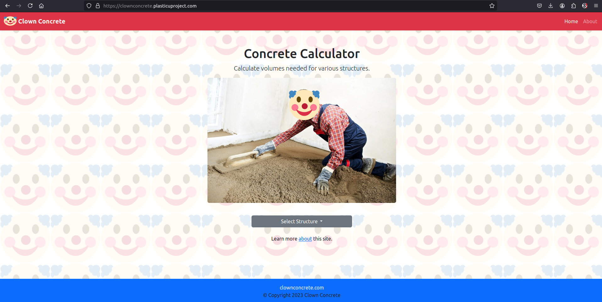
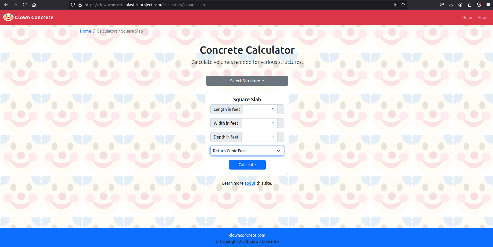
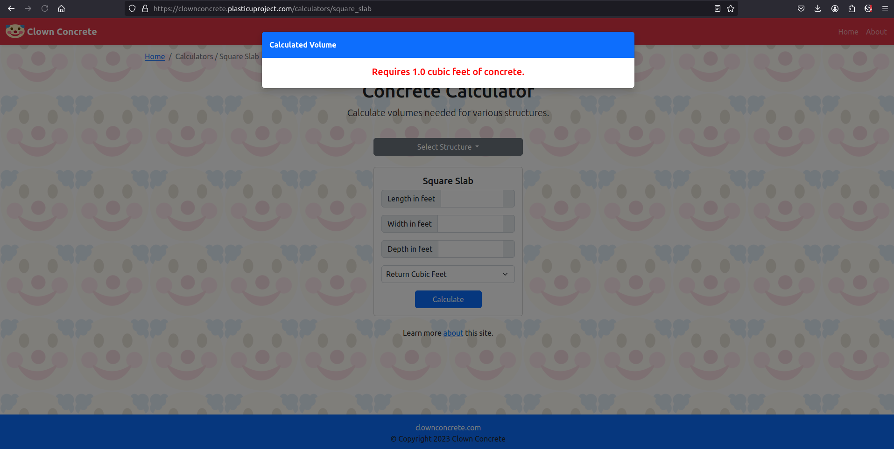
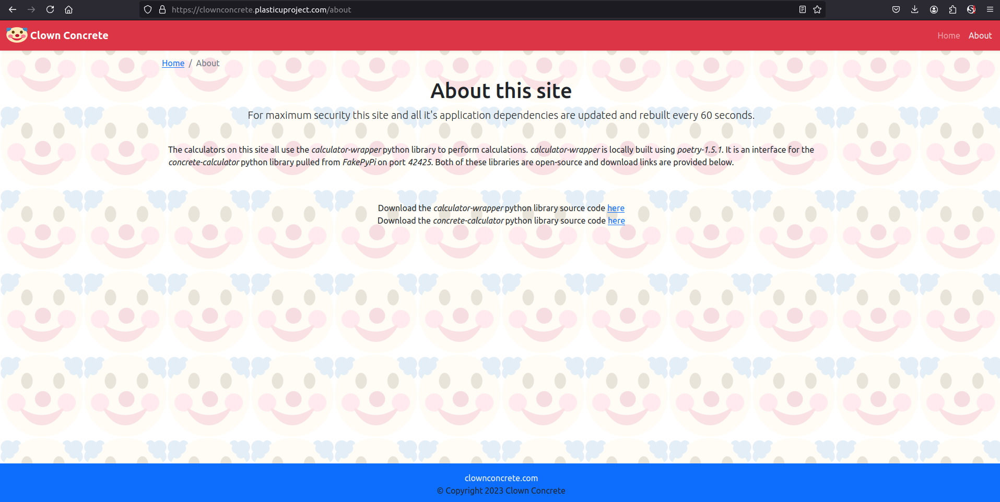

# Clown Concrete

## Simulated Supply-Chain Attack Challenge

This challenge demonstrates the risks associated with software supply-chains, using a custom-built Flask and Bootstrap web application. The application calculates concrete volumes for various structures based on user input. The web application and libraries are containerized and run through Docker with dependency re-builds every 60 seconds via supervisord. A private PyPI server is used to pull dependencies, with the entire setup running behind an NGINX reverse proxy, using Docker Compose for orchestration. This infrastructure creates a practical example of how a supply-chain attack could target vulnerable points in a dependency management pipeline. The challenge is intended to demonstrate and teach realistic exploit scenarios, including tool versioning misuse, tampering with dependency chains, and inserting malicious packages into software repositories.

## Prerequisites

-   **Docker + Docker Compose**: Ensure that Docker + Docker Compose are installed on your machine. You can download and install Docker from [here](https://www.docker.com/get-started).

## Getting Started

Simply run the following command to build and run the challenge using Docker Compose:

`docker compose up -d`

Visit the challenge web app in your browser at https://localhost:42424

To stop and delete the containers and images run:

`./tear_down.sh`

## Screenshots

